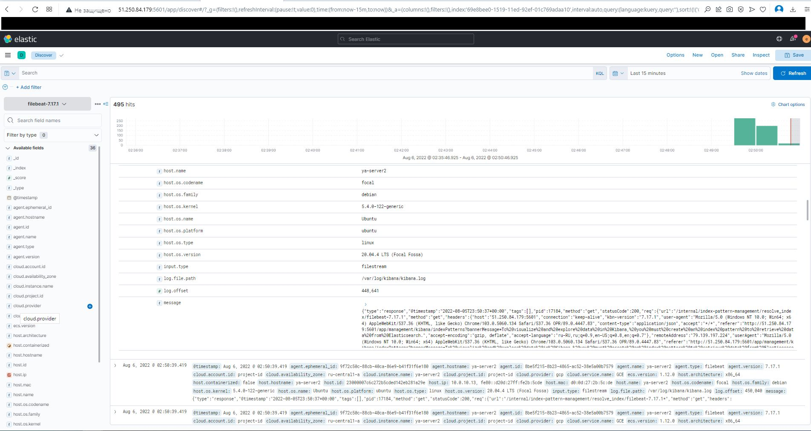
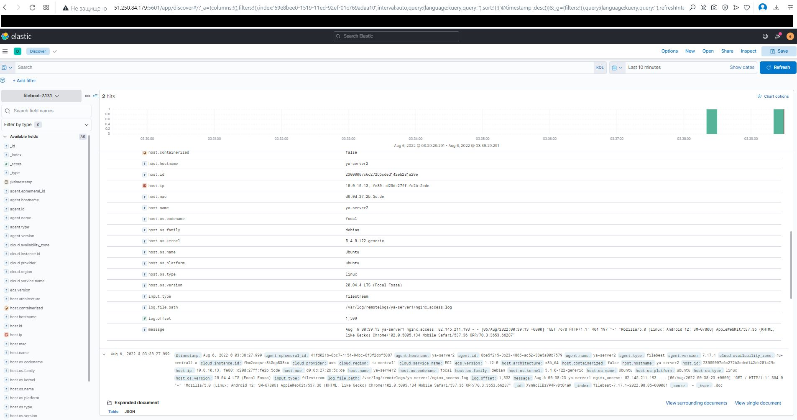

# Практикум 4.6

### Задание C4.6.1

> Скриншот:



Использовался Log shipper - Filebeat

> Содержание файла конфига - C4-6-1_filebeat.yml:

```
filebeat.inputs:
- type: filestream
  enabled: true
  paths:
    - /var/log/kibana/kibana.log
filebeat.config.modules:
  path: ${path.config}/modules.d/*.yml
  reload.enabled: false
setup.template.settings:
  index.number_of_shards: 1
setup.kibana:
  host: "localhost:5601"
  username: "elastic"
  password: "${ES_PWD}"
output.elasticsearch:
  hosts: ["localhost:9200"]
  username: "elastic"
  password: "${ES_PWD}"
processors:
  - add_host_metadata:
      when.not.contains.tags: forwarded
  - add_cloud_metadata: ~
  - add_docker_metadata: ~
  - add_kubernetes_metadata: ~
```

### Задание C4.6.2

> Скриншот:



Использовал следующую схему при передаче логов Nginx в Elasticsearch с последующим отображение логов в Kibana:

 Nginx -> remote rsyslog -> filebeat -> elasticsearch -> kibana

> Содержание файла конфига - C4-6-2_nginx.conf:

```
user www-data;
worker_processes auto;
pid /run/nginx.pid;
include /etc/nginx/modules-enabled/*.conf;
events {
	worker_connections 768;
	# multi_accept on;
}
http {
	sendfile on;
	tcp_nopush on;
	tcp_nodelay on;
	keepalive_timeout 65;
	types_hash_max_size 2048;
	include /etc/nginx/mime.types;
	default_type application/octet-stream;
	ssl_protocols TLSv1 TLSv1.1 TLSv1.2 TLSv1.3; # Dropping SSLv3, ref: POODLE
	ssl_prefer_server_ciphers on;
 
  log_format  jsonlog '{'
      '"host": "$host",'
      '"server_addr": "$server_addr",'
      '"http_x_forwarded_for":"$http_x_forwarded_for",'
      '"remote_addr":"$remote_addr",'
      '"time_local":"$time_local",'
      '"request_method":"$request_method",'
      '"request_uri":"$request_uri",'
      '"status":$status,'
      '"body_bytes_sent":$body_bytes_sent,'
      '"http_referer":"$http_referer",'
      '"http_user_agent":"$http_user_agent",'
      '"upstream_addr":"$upstream_addr",'
      '"upstream_status":"$upstream_status",'
      '"upstream_response_time":"$upstream_response_time",'
      '"request_time":$request_time'
        '}';
        
  access_log syslog:server=10.0.10.13:514,tag=nginx_access;
  
	gzip on;
 
	include /etc/nginx/conf.d/*.conf;
	include /etc/nginx/sites-enabled/*;
}

```

> Содержание файла конфига - C4-6-2_rsyslog.conf:

```
module(load="imudp")
input(type="imudp" port="514")

module(load="imtcp")
input(type="imtcp" port="514")

template (
    name="RemoteLogs"
    type="string"
    string="/var/log/remotelogs/%HOSTNAME%/%PROGRAMNAME%.log"
)

*.* -?RemoteLogs

stop

```

